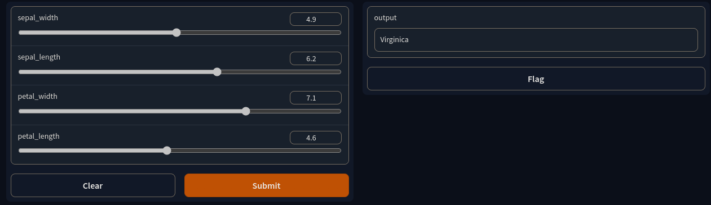

## ONNX Runtime Examples

This repo serves as an example of how to utilize ONNX Runtime CXX API to inference a machine learning model. The current model is a XGBoost Classifier trained on the Iris Dataset.

### Python Iris XGBoost Model & Gradio Predictor
Install the requirements via
```
pip install -r requirements.txt
```
Then run
```
python ore_ui.py
```

In a new tab, you should be able to see a gradio interface where you can predict a iris class using feature sliders. 
Should look like this:




### ONNX Runtime & C++ Example

ONNXRuntime is a microsoft utility that provides cross language machine learning & inference capability.
This is particulary useful for having a nice python training pipeline but inferencing in an existing larger software framework.
I have created an example - main.cc that you can build with
```sh
cmake --build .
```
It assumes you have installed ONNXRuntime to /usr/include and /usr/libs/onnxruntime

You will also need to change the model.onnx path in src/ml.cc 

The src/ml.cc file showcases how to create an ONNX runtime model inferencing the trained IRIS Dataset.
It's important to understand why initialization is separate from inference. If you run the ./mltest executable,
you should see a signifcant speed difference. As you increase the number of inferences, the speed of the slow
version will be limited to your disk bandwidth, which is very bad! You should only be loading the trained ONNX model _once_, not before every inference.

Do note that our trained model is small, and a decision tree. It's fast to inference on a regular CPU. 


#### CXX ONNX Data Syntax

The code to print out the result commented out, but once we inference the trained model using session_.run(..),
what returns is a somewhat complicated data structure, where the organization is as follows:
```cpp
Ort::Value seq(map(idx, Ort::Value))
```
This is expanded to

```cpp
(0, <(0, {labels}), (1, {predictions}>))
```

This will change if you change the model being trained! Maybe some kind of autosyntax parser would be a useful utility....
